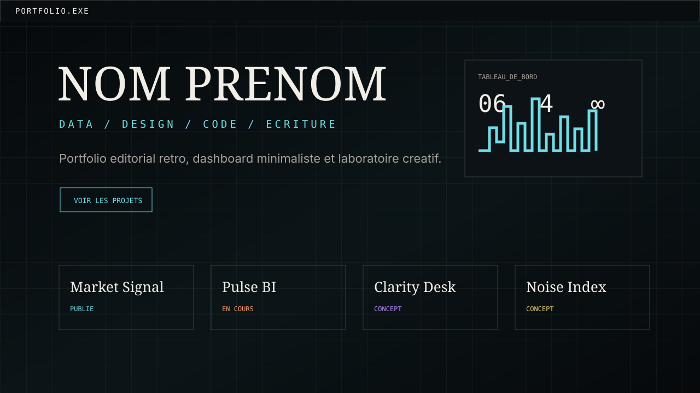

# ENZO DE MATOS - Portfolio Creatif Data / Design / Code


Portfolio personnel sombre, editorial et legerement retro, pense pour presenter un profil hybride : data marketing, analyse, UI/UX, programmation, ecriture, projets creatifs et culture artistique.

L'objectif : eviter le portfolio corporate interchangeable et proposer une presence web plus memorable, maintenable et prete pour GitHub Pages.

## Apercu



## Fonctionnalites

- Design responsive desktop / mobile.
- Mode sombre par defaut avec grille fine, texture legere et direction editorial-retro.
- Sections completes : hero, a propos, projets, competences, parcours, laboratoire, contact.
- Cartes projets generees depuis `script.js` pour modifier le contenu facilement.
- Micro-interactions discretes : reveal au scroll, curseur desktop, hover dynamique.
- Aucun framework, aucune dependance, aucun build obligatoire.
- Textes en francais et placeholders propres a remplacer.

## Stack

- HTML semantique
- CSS vanilla
- JavaScript vanilla
- GitHub Pages

## Structure

```text
.
├── index.html
├── styles.css
├── script.js
├── assets/
│   ├── noise.svg
│   └── preview-placeholder.svg
├── README.md
├── PROFILE_README.md
├── project.html
├── resume.html
└── style.css
```

`project.html`, `resume.html` et `style.css` sont des fichiers historiques conserves dans le depot. Le nouveau portfolio utilise `index.html`, `styles.css`, `script.js` et `assets/`.

## Lancer en local

Depuis la racine du depot :

```bash
python3 -m http.server 8501
```

Puis ouvrir :

```text
http://127.0.0.1:8501
```

## Modifier le contenu

Les donnees principales sont dans `script.js` :

- `profile`
- `projects`
- `skills`
- `timeline`
- `labItems`
- `contacts`

Remplace les placeholders :

- `NOM PRENOM`
- `email@example.com`
- `https://github.com/Brainfkt`
- `https://linkedin.com/in/votre-profil`
- liens GitHub / demo des projets

## Deploiement GitHub Pages

Methode simple depuis l'interface GitHub :

1. Aller dans le depot GitHub.
2. Ouvrir `Settings`.
3. Aller dans `Pages`.
4. Dans `Build and deployment`, choisir `Deploy from a branch`.
5. Selectionner la branche `main`.
6. Selectionner le dossier `/root`.
7. Enregistrer.

Pour ce depot `Brainfkt/Brainfkt`, l'URL de projet sera probablement :

```text
https://brainfkt.github.io/Brainfkt/
```

Pour obtenir une URL racine du type :

```text
https://brainfkt.github.io/
```

renommer ou creer un depot nomme exactement :

```text
Brainfkt.github.io
```

## Roadmap

- Ajouter une vraie capture d'ecran du site dans `assets/`.
- Remplacer les projets fictifs par des projets reels.
- Ajouter des pages de cas projet detaillees.
- Ajouter une version anglaise.
- Ajouter une action GitHub pour verifier automatiquement les liens.
- Brancher un formulaire de contact ou un service externe si necessaire.

## Auteur

**NOM PRENOM**
Data / marketing / UI-UX / code / ecriture / projets creatifs.

- GitHub : <https://github.com/Brainfkt>
- LinkedIn : <https://linkedin.com/in/votre-profil>
- Email : <email@example.com>
